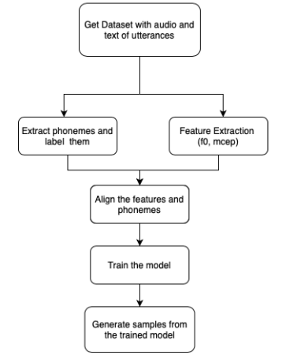

# HMM-based Emotional Text-to-speech

A repository with comprehensive instructions for using the Festvox toolkit for generating emotional speech from text. This was done as a part of a course project for Speech Recognition and Understanding (ECE557/CSE5SRU) at IIIT Delhi during Winter 2020.


---
# Contents
- [Dataset](#dataset)
- [Approach](#approach)
- [Training your own HMM models](#training-your-own-hmm-models)
  - [Requirements](#requirements)
  - [Setup](#setup)
    - [Docker Image](#docker-image)
    - [Audio Files](#audio-files)
    - [File with Utterances](#file-with-utterances)
  - [Training](#training)
    - [Preparing the Directory](#preparing-the-directory)
    - [Synthesis of Audio Files](#synthesis-of-audio-files)
    - [Building Voices](#building-voices)
      - [Manual build](#manual-build)
    - [Generating Voices](#generating-voices)   
- [Demonstration](#demonstration)
- [Trained Models](#trained-models)
- [References](#references)
- [Contact](#contact)

# Dataset

| Dataset | No. of Speakers | Emotions | No. of utterances | No. of unique prompts | Duration | Language | Comments | Pros | Cons|
| -- | -- | -- | -- | -- | -- | -- | -- | -- | -- |
| **[TESS](https://tspace.library.utoronto.ca/handle/1807/24487)** | 2 (2 female) | 7 (anger, disgust, fear, happiness, pleasant surprise, sadness, and neutral) | 2800 | 200 | ~2 hours | English | <ul><li>Consists of sentences of the form "Say the word ___"  where the blank is filled by a unique word</li><li> Each speaker has 200 new words spoken after the base sentence, for the 7 different emotions</li></ul> | <ul><li>Easily available</li><li>Emotions contained are very easy to interpret</li></ul> | <ul><li>Very limited utterances</li><li>Same base utterance leading to redundancy</li></ul> |
| **[EmoV-DB](https://github.com/numediart/EmoV-DB)** | 5 (3 male, 2 female) | 5 (neutral, amused, angry sleepy, disgust) |  6914 (1568, 1315, 1293, 1720, 1018) | 1150 | ~7 hours | English, French (1 male speaker) |<ul><li> The *Amused* emotion contains non-verbal cues like chuckling, etc. which do not show up in the transcript</li><li> Similarly, *Sleepiness* has yawning sounds.</li></ul> | <ul><li>Only large scale emotional corpus that we found freely available</li></ul> | <ul><li>Emotions covered are not very easy to interpret</li><li>The non-verbal cues make synthsis difficult</li><li> Also, not all emotions are available for all speakers</li></ul> |


# Approach

## :x: Approach 1: Using HTS toolkit for building emotional speech

The [HTS Toolkit](http://hts.sp.nitech.ac.jp/) is a go-to first step for HMM-based speech synthesis methods. We came across a lot of work which made use of HMM techniques to generate speech, which then referred to HTS for their implementation ([this paper](https://sci-hub.tw/10.1109/JPROC.2013.2251852), [this detailed lecture](https://www.cs.cmu.edu/~pmuthuku/mlsp_page/lectures/spss_specom.pdf) and [this beginner's guide](http://www.cstr.ed.ac.uk/downloads/publications/2010/king_hmm_tutorial.pdf) were extremely helpful)

### Observations 
- Even with the help of the HTS documentation, using and setting up HTS is not a cake-walk (which led us to build this README for a more structured approach) and due to the vast amount of parameteres to set, it gets extremely overwhelming for a beginner.
- When attempting to write the models from scratch, most of the techniques described in the papers above are incremental buildups of several other works, which was hard to trace and thus, implement

## :x: Approach 2: Using Festvox on the TESS Dataset

The next step was to try the [Festvox Toolkit](http://www.festvox.org/cmu_arctic/). We tried it on the TESS Dataset as detailed above.

### Observation

- Even though we were able to setup the HMM Toolkit, the TESS Dataset has repeated base utterances - "Say the word", followed by a unique word
- After the "Say the word", the model would find it difficult to utter the next word.
- Models are able to capture (different) emotion and expressive levels to some degree, but seem to be falling short on the vocabulary, so the next step would be to train it on a larger emotional corpus with a richer vocabulary like EmoV-DB

## :white_check_mark: Approach 3: Using Festvox on the EmoV-DB

The steps followed are documented in the following flowchart - 



The EmoV-DB dataset was formatted in the format given in [this section](#file-with-utterances). Further details about training from scratch is given [here](#training-your-own-hmm-models).


# Training your own HMM models
Festvox project is part of the work at [Carnegie Mellon University's speech group](http://www.speech.cs.cmu.edu) aimed at advancing the state of Speech Synthesis.

We will be using Festvox to train our HMM models and build voices.

## Requirements
- Docker
- Audio Files: The audio files to be used for training.
- File with utterances: A file which contains the path to the audio file and their transcripts. Schema is described below.

## Setup

### Docker Image
An already configured Docker Image is created by [mjansche](https://hub.docker.com/u/mjansche) for the Text-to-Speech tutorial at SLTU 2016. We will be training our HMM models using this Docker Image.

The Docker Image can be pulled by
```
docker pull mjansche/tts-tutorial-sltu2016
```
After pulling the docker image, we need to setup **flite** which is an open source small fast run-time text to speech engine.
To setup `flite`, run the docker image and once in the directory `/usr/local/src` run the following commands

```sh
git clone https://github.com/festvox/flite.git
cd flite
./configure
make
```

### Audio Files
The training requires PCM encoded 16bit mono wav audio files with a sampling rate of 16kHz. Please use `ffmpeg` to convert the recorded audio files to the correct format by running the following
```sh
ffmpeg -i input.mp3 -acodec pcm_s16le -ac 1 -ar 16000 output.wav
```

### File with Utterances
For training you need to make a file named **txt.done.data** with the base filenames of all the utterances and the text of each utterance. e.g.
```
( audio_0001 "a whole joy was reaping." )
( audio_0002 "but they've gone south." )
( audio_0003 "you should fetch azure mike." )
```
> **Caution**
> There is a space after/before the round braces and between the file name and the utterance. 
> The utterance must be in double quotes.

## Training
### Preparing the Directory
The first step to train HMM is to prepare the directory.
After running the docker image,

```sh
cd /usr/local/src/festvox/src/clustergen
mkdir cmu_us_ss
cd cmu_us_ss
$FESTVOXDIR/src/clustergen/setup_cg cmu us ss
```
> Instead of "cmu" and "ss" you can pick any names you want, but please keep "us" so that Festival knows to use the US English pronunciation dictionary. For indic voices, use "indic" instead of "us".

### Synthesis of Audio Files
Assuming that you have already prepared the audio files and the list of utterances,
```sh
cp -p WHATEVER/txt.done.data etc/
cp -p WHATEVER/wav/*.wav recording/
```

Assuming the recordings might not be as good as the could be you can power normalize them.
```sh
./bin/get_wavs recording/*.wav
```

Also synthesis builds (especially labeling) work best if there is only a limited amount of leading and trailing silence. We can do this by
```sh
./bin/prune_silence wav/*.wav
```
> **Note:** If you do not require these three stages, you can put your wavefiles directly into wav/

### Building Voices
For building voices, you can use an automated script that will do the feature extraction, build the models and generate some text examples.
```sh
./bin/build_cg_rfs_voice
```

#### Manual build
Firsty build the prompts and label the data.
```sh
./bin/do_build build_prompts etc/txt.done.data
./bin/do_build label etc/txt.done.data
./bin/do_clustergen parallel build_utts etc/txt.done.data
./bin/do_clustergen generate_statename
./bin/do_clustergen generate_filters
```

Then do feature extraction
```sh
./bin/do_clustergen parallel f0_v_sptk
./bin/do_clustergen parallel mcep_sptk
./bin/do_clustergen parallel combine_coeffs_v
```

Build the models
```sh
./bin/traintest etc/txt.done.data
./bin/do_clustergen parallel cluster etc/txt.done.data.train
./bin/do_clustergen dur etc/txt.done.data.train
```

### Generating Voices
We will use **flite** to generate audio from the trained model.
```sh
rm -rf flite
$FLITEDIR/tools/setup_flite
./bin/build_flite cg
cd flite
make
```
**flite** requires .flitevox object to build the voices. Create the .flitevox object by 
```sh
./flite_cmu_us_${NAME} -voicedump output.flitevox
```
Then audio can be easily generated for any utterance by
```sh
./flite_cmu_us_${NAME} "<sentence to utter>" output.wav
```

# Demonstration

We also make our system demonstration publicaly available within the ```hmm_wrapper``` directory. Further details are provided in the [README](https://github.com/Emotional-Text-to-Speech/hmm-for-emo-tts/blob/master/hmm_wrapper/README.md) of the directory.

# Trained Models

We also make the trained models for the different emotions available [here](https://drive.google.com/drive/folders/1Cgwis8BtXZuLXHD91XwfMLCF2GIB2A0J?usp=sharing). 

These models can be used for further fine-tuning or running the system provided in ```hmm_wrapper``` directory.

# References
[Festvox](http://festvox.org) : Festvox project developed by Carnegie Mellon University.\
[Docker](https://hub.docker.com/r/mjansche/tts-tutorial-sltu2016/) : Festvox configured docker image.\
[Building Data](http://www.cs.columbia.edu/~ecooper/tts/utt_eng.html) : The format for utterance file.\
[Training](http://festvox.org/bsv/x3528.html) : Steps to train the HMM Model.\
[Automated Script](http://festvox.org/cmu_indic/unpacked_all/cmu_indic_slp_mr/bin/build_cg_voice) : Description of the automated script.

---

# Contact

For any errors or help in running the project, please open an issue or write to any of the project members - 

- Pranav Jain (pranav16255 [at] iiitd [dot] ac [dot] in)
- Srija Anand (srija17199 [at] iiitd [dot] ac [dot] in)
- Eshita (eshita17149 [at] iiitd [dot] ac [dot] in)
- Shruti Singh (shruti17211 [at] iiitd [dot] ac [dot] in)
- Pulkit Madaan (pulkit16257 [at] iiitd [dot] ac [dot] in)
- Aditya Chetan (aditya16217 [at] iiitd [dot] ac [dot] in)
- Brihi Joshi (brihi16142 [at] iiitd [dot] ac [dot] in)

